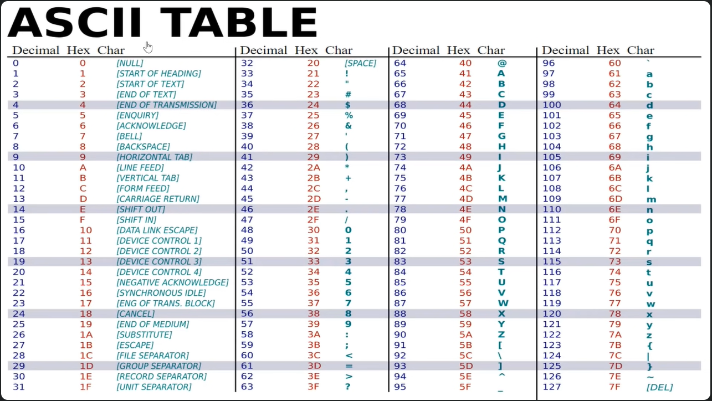
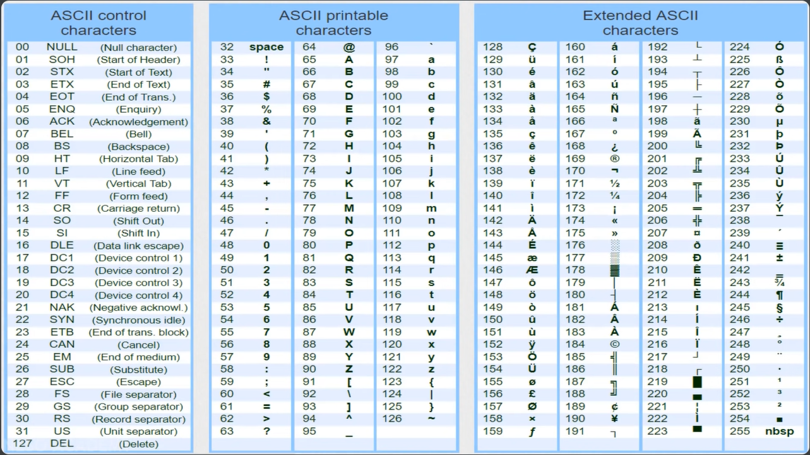

# Master of C Programming

## Day 1

### v1 - Introduction

### v2 - C Language Features

### v3 - C Variables

### v4 - C Variable Naming

### v5 - Basic output function

### v6 - Fundamental Data types part 1

### v7 - Fundamental Data types part 2

### v8 - Exceeding the valid range of data types

### v9 - Char with ASCII and with Extended ASCII

### v10 - Float, Double, long Double

### v11 - Quiz 1

## Day 2

### v12 - Scope of variable

### v13 - Variable modifier ( Auto & Extern )

### v14 - Variable modifier ( Register )

### v15 - Variable modifier ( Static )

### v16 - Variable modifier ( const & #define ) part 1

### v17 - Variable modifier ( const & #define ) part 2

### v18 - Quiz 2

### v19 - Taking input ( scanf )

### v20 - Quiz 3

### v21 - Operators in c

### v22 - Arithmetic Operators in c

### v23 - Increment/Decrement part 1

### v24 - Increment/Decrement part 2 - Quiz

### v25 - Relational Operator

### v26 - Short Circuit in c

### v27 - Bitwise part 1

### v28 - Bitwise part 2

### v29 - Bitwise part 3

### v30 - Bitwise part 4

### v31 - Assignment operator

### v32 - Conditional / Ternary Operator

### v33 - Comma (,) operator

### v34 - Quiz 3

### v35 - Quiz 3

### v36 - Quiz 3

### v37 - Quiz 3

### v38 - Quiz 3

### v39 - Quiz 3

### v40 - Quiz 3

# Full Outline:

C Programming:
1) Introduction to the course.
2) Variables 
3) Global vs Local variables. 
4) Data types  
5) Operators in C  
6) Conditionals and loops 
7) Functions 
8) Recursion  
9) Pointers and arrays 
10) Strings
11) Structure and union 
12) File Handling

Data Structures:
1) Stacks  
2) Queues  
3) Linked list 
4) Trees  
5) Binary search trees  
6) Binary Heaps  
7) Graphs  
8) Tree Traversals

[Playlist](https://youtube.com/playlist?list=PLBlnK6fEyqRhX6r2uhhlubuF5QextdCSM&si=KauFwcAzYFQny9qO)

